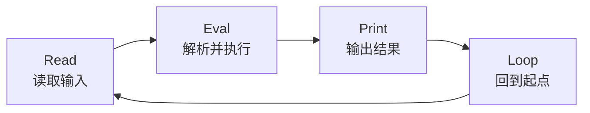
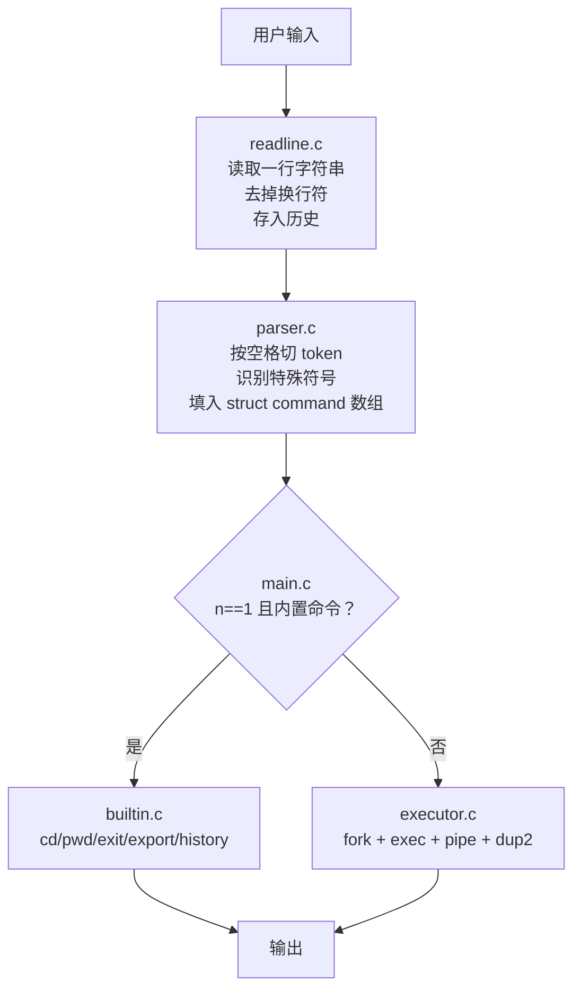
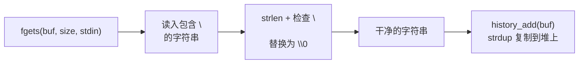
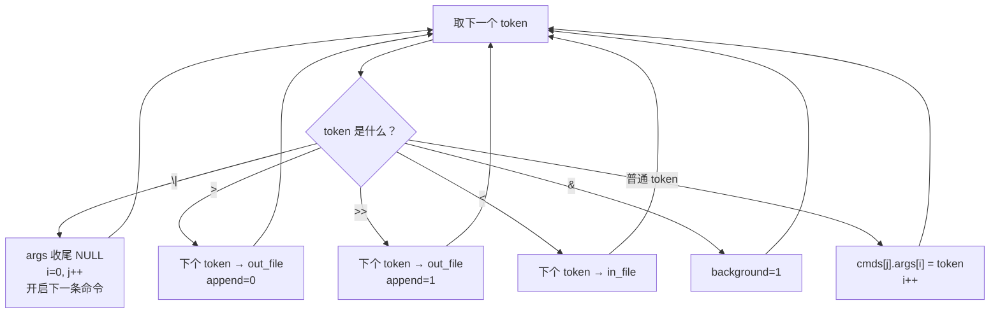
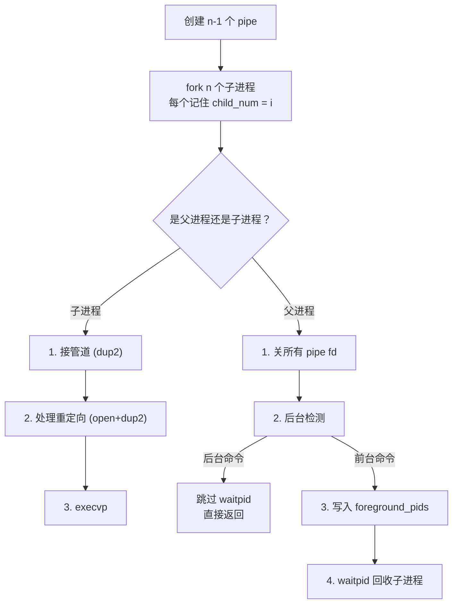
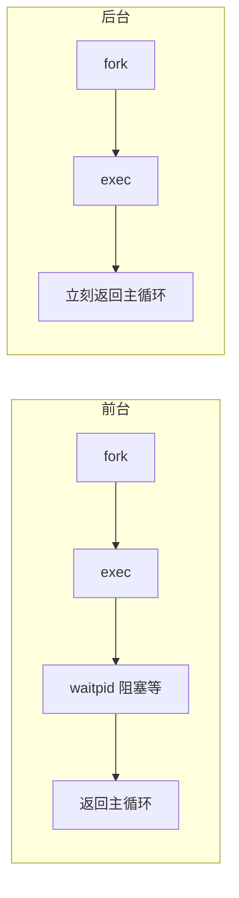

# Mini-Shell 项目复盘笔记

## 一、核心流程：REPL

对于mini-shell这个项目，我们首先要确认，他的核心功能很简单，用户输入命令，程序解析并执行命令，输出结果，重新开始循环。这就是mini-shell的核心流程，我们依旧保持main.c简洁的原则，其内部主要执行这个流程。

以上流程，经过拆分，就构成了一个REPL（可交互式命令行循环）的流程，那么便是，read（读取），eval（解析），print（输出），loop（循环）。我们接下来就要对这个流程进行详细的拆解。



| 环节 | mini-shell 中的位置 |
|------|------|
| Read | `readline.c` |
| Eval | `parser.c` + `builtin.c` / `executor.c` |
| Print | 子进程 stdout 直接输出到终端/管道/文件，shell 不代劳 |
| Loop | `main.c` 里的 `while(1)` |

结合我们已有的知识，对于读取，我们输入的是指令，也就是字符串，那么程序获取到的，就是字符数组，这个时候我们可以联系到另一个知识，exec系列，这个系列根据获取到的字符串，拼出指令去执行，如此，两个步骤就有了联系，我们主要探讨的环节，就是如何把收集到的字符数组，整合成exec需要的形式，实现指令的发出。此外，我们要记住exec对应的是外部指令，而内部指令要简单很多，需要的东西也差不多。

> **和 Python REPL 的区别**：Python 解释器"算出值→print 打印"。Shell 把 stdout 直接交给子进程，子进程输出什么就是什么，shell 自己只负责接线。

---

## 二、模块拆分思路



综上所述，我们可以这样构思出几个程序文件了：

1. 主程序main.c，用来进行核心流程REPL
2. 读取输入程序readline.c，用来获取我们输入的一行指令，以字符数组的形式
3. 字符串拆分程序parser.c，用来将字符数组重构成一个exec可接受的形式，这个环节很重要，由于我们的指令会夹杂一些特殊符号，比如"\|"，">"，"<"，">>"，"&"，我们要对他们分别进行识别，然后还要对应有标记，这样，我们重构后，要储存的数据太多了，于是，自然而然的，我们会想到使用结构体，而对于"\|"，我们知道这个代表着两条指令，需要两组数据，单一的结构体也难以应对，更高一级的结构体数组便出现了。最后，我们便可以得到一个装着拆解后的输入命令的结构体数组。
4. 内部指令程序builtin.c，用来分配内部指令，对于内部指令的判断，我们可以得知其是不需要任何特殊符号的，只需要"命令名"和对应参数就可以。大部分内部指令有对应的内置命令，可以很简单实现，而history命令，需要我们的额外编写，这个获取我们输入指令历史的操作，我们需要在readline那一个步骤就进行储存。
5. 外部指令程序executor.c，这是最复杂的，基础的执行就需要父子程序，加上特殊执行，包括管道，重定向，后台程序（也就需要用到信号了）……

就此，对于程序文件的结构我们梳理完毕，值得注意的是，除了后台程序的信号，我们还需要考虑一种防卡死的强制退出Ctrl+C，这个信号也是必要的，main.c的功能也因此要多加一条，声明两个信号。

> **核心思想：关注点分离（Separation of Concerns）**。每个模块只解决一个问题，彼此通过 `struct command` 通信。parser 不认识 executor，executor 也不认识 parser——它们只认识 `struct command`。就像 I2C 总线上的设备，每个设备只管自己的事，通过总线协议通信。

---

## 三、为什么要用结构体数组

parser 解析 `ls -l | grep foo > out.txt` 后，需要传递的信息量很大。单靠几个 `char **` 和 `char *` 传不过去。于是在 parser.h 里定义了 `struct command`：

```c
struct command {
    char *args[MAX_ARGS];    // execvp 风格的参数数组
    char *in_file;           // < 重定向输入文件
    char *out_file;          // >  >> 重定向输出文件
    int  append;             // 0=覆盖(>), 1=追加(>>)
    int  background;         // 0=前台, 1=后台(&)
};
```

管道让命令数从一个变成多个，于是 `struct command[]` 数组应运而生——每条命令一个元素。

> **核心思想：接口契约（Interface as Contract）**。两个模块之间不直接传散装数据，而是约定一个结构体作为"通信协议"。以后 parser 加新功能，executor 不用改——只要结构体字段兼容就行。**这和你写 STM32 代码时，用一个 GPIO_InitTypeDef 结构体传所有 GPIO 配置是一个道理。**

---

## 四、readline.c 的实现

获取字符串，我们有多种方法，但scanf遇到空白会停下，gets已经被淘汰，read具体读多少难以确定，于是我们选择采用了fgets，这个会一直读到换行符，并且不会溢出的方法。这里其实还有一个更高级的getline，但是其涉及到free及内存管理，太麻烦，我们并不需要。读取后，由于fgets的特性，其会把换行符也读进去，所以我们会在读取后删掉换行符，而在这一步后，我们需要的字符数组已经得到，就可以添加到历史记录里。

对于历史记录，我们选择了128的上限。



对于历史记录的存储，readline.c 内部用 `static` 修饰 `history[]` 数组和 `history_count`，这些数据对外不可见。builtin 通过 `history_size()`、`history_get()` 这些公开接口来访问。

> **核心思想：封装（Encapsulation）**。数据 (`history[]`) 是私有的，访问只能通过公开接口。以后把数组改成链表——只改 readline.c，builtin.c 一行不动。

---

## 五、parser.c 的实现

linux命令，命令与参数、特殊字符之间都以空格分隔，而我们的读取，也应按照空格进行分隔，这就用到了strtok这个函数，在循环中，我们完成一步后，就使用strtok(NULL,s)来移动到下一个空格处（这里我们使用s来同时表示单纯的空格和tab制表符）。

### strtok 是怎么工作的

strtok 不创建新字符串——它直接把原字符串里的分隔符替换成 `\0`，然后返回指向被截断的子串的指针。`NULL` 参数的含义：**"继续切上次那条字符串"**，不是"没参数"。strtok 内部用 `static` 变量记住切到哪了。

> **strtok 的 `static` 代价**：strtok 是不可重入的——全局只有一个 `static next` 指针，多线程/信号处理里不能用。但对于单线程 shell 没问题。Linux 内核用 `strsep` 替代 strtok。

### 结构体字段与特殊符号的对应

我们的结构体数组，不仅要储存参数，还要储存一些特殊的含义。我们设置了args[]表示参数数组，out_file来表示输出重定向标记，in_file来表示输入重定向标记，append来表示>>和>的区分，background来表示后台标记。其中的out_file和in_file由于重定向符号后接的一定是一个"地点"，不要进入args数组，所以直接用这两个来储存这个"地点"。

parser 主循环逻辑：



在我们这个循环中，我们要有两个计数器，j表示结构体数组的下标，对应的是"\|"带来的影响，另一个i表示args数组的下标。在完成循环后，我们返回j+1，表示一共有几个命令。

---

## 六、builtin.c 的实现

这一个环节比较简单，我们主要通过比较文件名，来确认输入是cd，pwd，exit，export，history的哪一个，根据这几个内置命令所需参数的不同，进行不同的参数读取操作，其中特别的是cd的空参数对应home，export配置环境变量对于多参数的分隔与检测（因为它的参数有更细化的的等号分割），history的特别调用……基本上都是一些比较独立的注意点，普适性不强。

| 命令 | 调用的系统函数 | 为什么必须是内置 |
|------|------|------|
| `cd` | `chdir(path)` | 改的是**进程自己的工作目录**——子进程改了没用，一死就还原 |
| `pwd` | `getcwd(buf, size)` | shell 自己就能问内核，不需要子进程 |
| `exit` | `exit(code)` | 要退出的是 shell，不是子进程 |
| `export` | `setenv(name, val, 1)` | 环境变量要写进**shell 的环境表**，子进程才能继承 |
| `history` | 遍历 history 数组 | 数据在 readline.c 的 static 数组里，没现成的系统调用 |

> **核心概念：进程隔离**。fork 之后子进程有自己的地址空间、自己的当前目录、自己的环境变量。改子进程的环境不影响父进程。所以一切"需要改变 shell 自身状态"的命令都必须是内置。

---

## 七、executor.c 的实现

这个环节是重中之重，最基础的步骤，在没有其他特殊情况下，我们需要fork，随后在子程序中execvp。而现在，我们需要加上检测。



### 管道部分

管道检测，当我们有n条命令时，我们需要有n-1个管道，为了管理，我们设置了一个储存管道的数组 `pipes[n-1][2]`。

随后，我们进入了正常创造子程序的步骤，并给每个子程序对应一个"数字标记"。然后就是正常的程序检测了，在子程序中，我们先进行管道的连接，这里我们采用dup2来连接（刚才的数字标记这里派上了用场），这里是需要注意的，重定向不仅仅可以用在重定向指令里，他也是一个强大的连接管道方式，比起单独的close读或close写，它更加简洁。

对于几个管道，我们检测的是其"是否不为第一个"与"是否不为最后一个"，如果满足前者，就将其管道读连接到输入端，如果满足后者，就将其管道写连接到输出端，这样我们此后的输入内容直接从管道那里去读取，输出的东西则写到管道里面，这样就串起来了。如果有三个管道，第一个管道从终端获取输入，然后它的输出写入了管道里，第二个管道会从管道中读取第一个指令传来的数据当做输入，然后再把自己的输出写进管道里，最后一个管道就从管道中读取第二个管道传来的数据当做输入，输出到终端。

以 `ls | grep foo | wc -l` 为例（3条命令→2根管道）：

```mermaid
flowchart LR
    subgraph 命令0
        LS[ls]
    end
    subgraph 命令1
        GREP[grep foo]
    end
    subgraph 命令2
        WC[wc -l]
    end

    TTY_IN[终端] -->|stdin| LS
    LS -->|stdout| P0W[pipes[0] 写端]
    P0W --> P0R[pipes[0] 读端]
    P0R -->|stdin| GREP
    GREP -->|stdout| P1W[pipes[1] 写端]
    P1W --> P1R[pipes[1] 读端]
    P1R -->|stdin| WC
    WC -->|stdout| TTY_OUT[终端]
```

代码上就是两条规则：

```c
if (i > 0)       // 不是第一条 → stdin 接前一根管道的读端
    dup2(pipes[i-1][0], STDIN_FILENO);
if (i < n-1)     // 不是最后一条 → stdout 接下一根管道的写端
    dup2(pipes[i][1], STDOUT_FILENO);
```

> **为什么要一次性创建所有管道**：如果逐条命令串行执行（fork ls→等ls结束→fork grep），管道缓冲区写满后 ls 会阻塞——而 grep 还没被 fork 出来读数据，死锁。所以必须在 fork 所有子进程之前把管道全建好，让所有子进程同时跑。

在完成连接后，依旧照常关闭管道，因为此时子程序dup2完成了，对于管道，只需要有一个输入或者输出口存在，而此刻还有原始的端口打开着，必须关掉，防止其泄露（不关的话，读端永远开着，写进程读不到EOF会永久阻塞）。

### 重定向部分

随后就是重定向检测，三种不同形式的重定向检测，打开文件的读端或写端，重定向连接，关闭文件端口。

| 输入 | open flag | dup2 方向 |
|------|------|------|
| `< in.txt` | `O_RDONLY` | `dup2(fd, STDIN_FILENO)` |
| `> out.txt` | `O_WRONLY \| O_CREAT \| O_TRUNC` | `dup2(fd, STDOUT_FILENO)` |
| `>> out.txt` | `O_WRONLY \| O_CREAT \| O_APPEND` | `dup2(fd, STDOUT_FILENO)` |

重定向优先级高于管道——`ls | grep > out.txt` 中 grep 的 stdout 先被管道连接，后被文件重定向覆盖，最终 stdout 进文件不进管道。

最后就是execvp了，这也是子程序最后的执行。

> **`dup2` 的本质**：它不操作数据，只操作 fd 表的"指向关系"。可以把 stdout(fd=1) 从终端"拔下来"，接到文件或管道上。被 exec 的新程序完全不知道这个切换——它只管往 stdout 写，shell 决定 stdout 去哪。**拿你熟悉的 I2C 来类比：dup2 就是重接线——把本来接 OLED 的 SDA/SCL 切到 EEPROM 上，数据发送函数 `I2C_SendData()` 一行不用改。**

### 后台运行 `&`

前后台的区别只有一件事——**父进程等不等**：



后台进程结束后内核发 SIGCHLD，handler 里非阻塞回收：

```c
void sigchld_handler(int sig) {
    while (waitpid(-1, NULL, WNOHANG) > 0)
        ;   // WNOHANG: 没有死孩子立刻返回0，不阻塞
}
```

> **fork 的 fd 表继承**：fork 后子进程的 fd 表是父进程的**拷贝**——pipe 创建的 fd 全部继承。这就是为什么可以在 fork 之前建 pipe，子进程里直接就能用——不需要通过参数传递。**fd 表是进程的内核属性，不是普通内存变量。fork 时 fd 的值（一个 int 数字）被复制了，但内核里这个数字指向的 pipe 对象还是同一个。父进程关了自己那端，不影响子进程手里那端。**

### 父进程部分

父程序环节，要进行四个循环，关闭管道、后台检测、全局pids配置，回收僵尸。对于全局pids配置，信号handler配置在main.c，为了让主函数知道Ctrl+C要杀谁，我们需要将子进程pid写入全局变量里。

---

## 八、main.c 的实现

作为主函数，自然越精简越好，REPL的流程，全局变量的声明，两个handler函数，信号的配置，都是需要注意的。

| 信号 | 触发条件 | handler 做什么 | 没有会怎样 |
|------|------|------|------|
| SIGCHLD | 子进程死亡 | `waitpid(-1, ..., WNOHANG)` 回收僵尸 | `ps aux` 出现 `<defunct>` |
| SIGINT | Ctrl+C | `kill(foreground_pids[], SIGINT)` 杀前台 | shell 自己也被杀，退出 |

主循环每轮开始前用 `memset(cmds, 0, sizeof(cmds))` 把整个结构体数组清零，否则上一轮的 `out_file` / `in_file` 残留会导致误判（我和姐姐调试时发现的重要bug）。

---

---

## 十、管道五条铁律

经过模拟面试的逐层追问，管道的所有行为可以归纳为五条规则：

```
1. 双向单工：数据一端进一端出，不能反过来
2. 引用计数：所有写端关闭 → 读端收到 EOF
3. 引用计数：所有读端关闭 → 写端收到 SIGPIPE
4. 有限缓冲：64KB，满了写端阻塞，空了读端阻塞
5. 并行前提：两端必须同时存在，逐个创建 = 死锁
```

之前 Level 1-4 所有被问到的问题——忘了 close 会怎样、SIGPIPE 从哪来、cat 为什么被杀、逐个等待为什么会死——答案全是这五条里的某一条。**吃透一个机制，就是把它的行为规则变成直觉，而不是背 API。**

具体分析：执行 `cat huge_file | head -5` 时，head 读 5 行退出 → 管道的读端全部关闭 → cat 的 write 触发 SIGPIPE → cat 被内核杀死。如果改成逐条命令串行（等 cat 跑完再 fork head），cat 写满 64KB 后阻塞，父进程 waitpid 永远不返回，head 永远不被创建——三方死锁。这就是"必须一次性建好所有管道"的根本原因。

> **引申：这个设计思想叫"流式处理（Stream Processing）"**——数据一边产生一边消费，不需要全产完再传，也不需要落盘。Unix 管道的设计哲学就是"让多个小程序协同工作"——前提是它们能同时跑、能互相传数据。Linux 内核驱动中传感器数据通过 mmap 环形缓冲传给用户态 daemon，本质上也是流式处理。

## 十一、SIGCHLD 竞态条件

原代码里有一个隐藏 bug：两个回收者争抢子进程。

```c
// main.c — SIGCHLD handler
void sigchld_handler(int sig) {
    while (waitpid(-1, NULL, WNOHANG) > 0) { ; }
}

// executor.c — 父进程 waitpid 循环
for (int j = 0; j < n; j++) {
    waitpid(-1, &status, 0);   // 和 handler 抢！
}
```

这三行产生了严重的**竞态条件（Race Condition）**：

1. SIGCHLD handler 提前抢收了某子进程 → executor 的 `waitpid(-1)` 返回 -1 → `status` 为未定义值
2. 此时 `WIFSIGNALED(status)` 读到垃圾，曾经打印出 "killed by signal 71"（PIPE 是 13，71 是垃圾）
3. handler 用 `NULL` 丢弃了退出状态，丢失了真实的退出信息
4. 不可复现——取决于调度，有时 handler 先到有时 executor 先到

**修复方法**：
- 删掉 SIGCHLD handler 里的 waitpid（handler 退化为空函数）
- 把 executor 里的 `waitpid(-1, ...)` 改成 `waitpid(pids[j], ...)`，精确等每个 pid
- 同时加 `WIFEXITED` 打印，正常退出也显示退出码

> **教训**：同一个资源（子进程状态）被两个模块共享时，只有一个模块能回收。这不是两个代码都"写对了"——它们不知道自己共享了资源。关注局部正确、忽略全局交互是初学者的典型问题。以后写内核驱动，两个子系统抢同一个锁，bug 形态跟这个一模一样。

## 九、收获与反思

以上，就是mini-shell项目实现流程的分析，经过这次学习，我认识到了架构的重要性，在完成一个项目前，一定要先把他的架构搞清楚，理解这些文件之间的关系，信息的传递（这个很重要，因为涉及到内存，有时候必须以一些特定的数据类型去传递信息）。而细化的编写，考验的就是你的仔细，把思路转化为代码，知道这个"想法"对应什么函数，知道数据的界限，把零散的所学运用起来，正是这个项目的最大意义。

### 把概念翻译成代码

| 想法 | 对应的系统调用/函数 |
|------|------|
| "切分输入" | `strtok` |
| "创造子进程" | `fork` |
| "执行程序" | `execvp` |
| "把输出接到文件" | `open` + `dup2` |
| "把两个进程串起来" | `pipe` + `dup2` |
| "等子进程结束" | `waitpid` |
| "后台不等" | 跳过 `waitpid` |
| "Ctrl+C不杀shell" | `sigaction(SIGINT, ...)` |

---

## 附录：项目文件总览

| 文件 | 职责 |
|------|------|
| `main.c` | REPL 循环 + 信号 + 分发 |
| `readline.c` | 输入读取 + 历史管理 |
| `parser.c` | token 拆分 + 结构体填充 |
| `builtin.c` | 5 个内置命令 |
| `executor.c` | fork/exec + 管道 + 重定向 + 后台 |

5 个 `.c`，5 个 `.h`，1 个 Makefile，总计约 420 行。一个可交互的完整 Shell。
